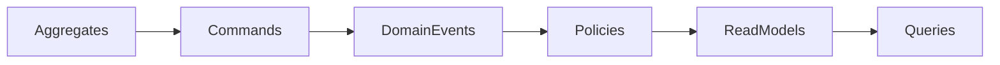

# Household Financial Intelligence (HFI)

> **Domain Blueprint Repository**

[](#)
[](#)
[](#)
[](#)

---

## Overview

**Household Financial Intelligence (HFI)** is a domain-first initiative that aims to build a financial operating system for households.

Unlike traditional expense-tracking applications, HFI focuses on creating a **single source of financial truth**, enabling the platform to evolve from capturing financial facts to providing intelligent financial recommendations.

This repository does **not** contain application code.

It contains the **Domain Blueprint**, which defines the business language, domain model, architectural decisions and design principles that guide every implementation of the platform.

The Domain Blueprint is considered the **source of truth** for the business domain.

---

# Vision

Enable households to understand, analyze and continuously improve their financial health through a domain model capable of evolving from financial facts to actionable advice.

---

# Mission

Transform fragmented financial information into trusted knowledge that empowers families to make better financial decisions.

---

# Product Philosophy

The platform is built around four progressive business capabilities.

```text
Financial Acquisition
        │
        ▼
Financial Understanding
        │
        ▼
Financial Intelligence
        │
        ▼
Financial Advisory
```

Each capability builds upon the previous one.

No capability bypasses another.

---

# Guiding Principles

The domain is intentionally designed following the principles of:

* Domain-Driven Design (Eric Evans)
* Implementing Domain-Driven Design (Vaughn Vernon)
* Event Modeling (Adam Dymitruk)
* CQRS
* Event-Driven Architecture
* Strategic Design
* Tactical Design

Core principles:

* Business before Technology.
* Model First, Code Second.
* Facts are Immutable.
* Interpretations Evolve.
* Knowledge is Derived.
* Advice is Contextual.
* Small Aggregates.
* Reference Aggregates by Identity.
* Explicit Business Language.
* Capabilities before Features.

---

# Repository Structure

```text
.
├── README.md
├── DOMAIN_MANIFESTO.md
├── CHANGELOG.md
├── CONTRIBUTING.md
│
├── docs/
│   ├── 00-overview/
│   ├── 01-business/
│   ├── 02-strategic-design/
│   ├── 03-tactical-design/
│   ├── 04-architecture/
│   └── adr/
│
├── diagrams/
│
├── assets/
│
└── mkdocs.yml
```

---

# Domain Documentation

The documentation is organized following the natural evolution of the domain.

## 1. Overview

* Introduction
* Domain Vision
* Domain Principles
* Capability Map
* Glossary

## 2. Business

* Business Capabilities
* Ubiquitous Language
* Domain Storytelling
* Business Rules

## 3. Strategic Design

* Event Storming
* Bounded Contexts
* Context Map
* Future Domain

## 4. Tactical Design

* Aggregate Specifications
* Entities
* Value Objects
* Commands
* Domain Events
* Policies
* Domain Services
* Read Models
* Queries
* State Machines

## 5. Architecture

* Event Model Board
* CQRS
* Event-Driven Architecture
* Integration Strategy
* Roadmap

## 6. Architecture Decision Records

Every important architectural decision is documented as an ADR.

---

# Capability Model


---

# Strategic Design


---

# Tactical Design



---

# Core Domain

The MVP focuses on the following Aggregates:

* Household
* Financial Account
* Financial Movement
* Budget
* Financial Goal

Additional concepts discovered during the modeling process are documented in the **Future Domain** and intentionally excluded from the MVP.

---

# Design Principles

The HFI domain distinguishes three fundamental concepts.

## Facts

Facts represent immutable financial events.

Examples:

* Financial Movement
* Financial Account
* Financial Document

Facts never change.

---

## Interpretations

Interpretations provide business meaning to facts.

Examples:

* Movement Classification
* Merchant Normalization
* Taxonomy

Interpretations may evolve over time.

---

## Knowledge

Knowledge is always derived from facts and interpretations.

Examples:

* Monthly Spending
* Budget Execution
* Financial Health
* Cash Flow
* Trends

Knowledge is never stored as the source of truth.

---

# Documentation Workflow

Every business decision follows the same lifecycle.


No implementation should introduce domain concepts that are not first described in this repository.

---

# Versioning

The Domain Blueprint evolves independently from the implementation.

Every release represents a stable version of the business domain.

Example:

* v0.1 – Initial Domain Discovery
* v0.5 – Strategic Design Complete
* v1.0 – MVP Domain Blueprint
* v2.0 – Financial Intelligence
* v3.0 – Financial Advisory

---

# Contributing

Before proposing implementation changes:

1. Validate the business need.
2. Update the Domain Blueprint.
3. Document architectural decisions as ADRs when required.
4. Review the ubiquitous language.
5. Keep the domain model technology-agnostic.

---

# Domain Manifesto

The repository follows the principles defined in `DOMAIN_MANIFESTO.md`.

Technology may change.

Frameworks may change.

Cloud providers may change.

Programming languages may change.

**The Domain is the product.**
