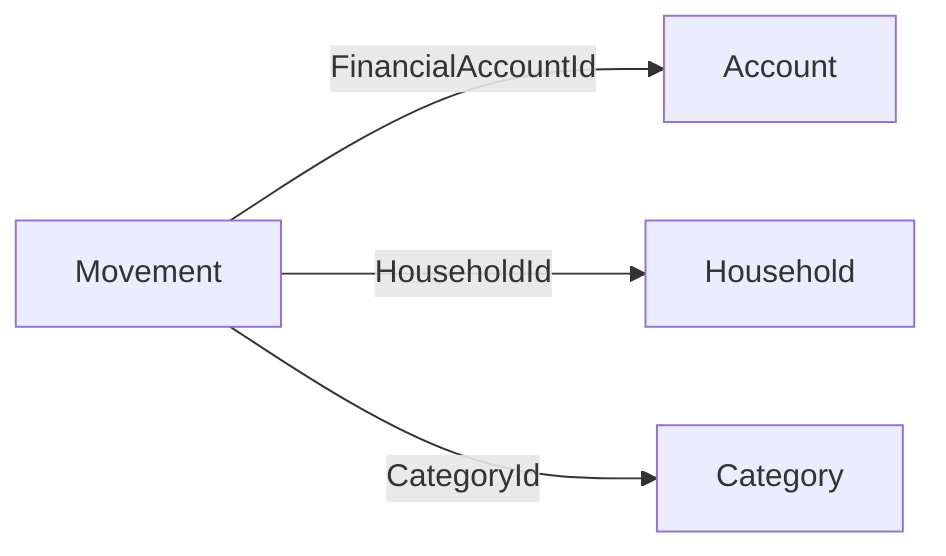
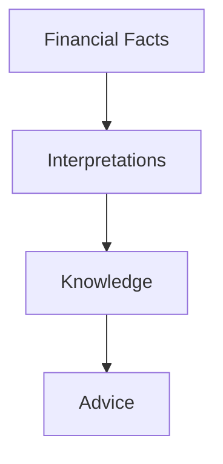

# Domain Principles

---

# Purpose

This document defines the fundamental principles that govern the Household Financial Intelligence (HFI) domain.

Unlike implementation guidelines or architectural decisions, these principles are considered **timeless**.

Every bounded context, aggregate, domain event, read model and architectural decision must comply with these principles.

Whenever a new design decision conflicts with one of these principles, the principle takes precedence.

---

# Principle 1 — Business Before Technology

The domain must never depend on implementation technologies.

Business concepts are permanent.

Technologies are temporary.

## Implications

The domain never contains concepts such as:

* Gmail
* PostgreSQL
* AWS
* Lambda
* Google Apps Script
* REST
* GraphQL

Instead, the domain speaks about:

* Financial Sources
* Financial Documents
* Financial Movements
* Households
* Budgets
* Financial Goals

---

# Principle 2 — Model First, Code Second

The business model is designed before implementation.

Software is an implementation of the domain.

The domain is never an implementation of the software.

## Implications

Every important business concept must first appear inside the Domain Blueprint.

Only after being validated should it become source code.

---

# Principle 3 — Facts Are Immutable

Financial facts represent events that already happened.

Facts cannot be modified.

Facts can only become invalid.

Examples of immutable facts include:

* transaction amount
* transaction date
* original merchant reference
* original financial document

The platform preserves financial truth.

It never rewrites history.

---

# Principle 4 — Interpretations Evolve

Business understanding improves over time.

Interpretations may change without changing the original fact.

Examples include:

* movement category
* merchant normalization
* spending purpose
* confidence level

The platform separates facts from interpretations.

---

# Principle 5 — Knowledge Is Derived

Knowledge is never entered manually.

Knowledge is calculated from facts and interpretations.

Examples include:

* monthly spending
* cash flow
* financial health
* budget execution
* spending trends

Whenever knowledge becomes inconsistent, it must be recalculated.

---

# Principle 6 — Advice Is Contextual

Financial advice depends on the current state of knowledge.

Recommendations are never stored as permanent truth.

Advice is generated from:

* financial facts
* financial knowledge
* household goals
* current context

---

# Principle 7 — Small Aggregates

Aggregates protect business consistency.

Aggregates do not model relationships.

Each Aggregate has a single responsibility.

Each command modifies one Aggregate.

Each Aggregate protects a minimal set of invariants.

---

# Principle 8 — Reference by Identity

Aggregates never reference other Aggregates directly.

Relationships are represented exclusively through identifiers.

This principle minimizes coupling and improves scalability.

---

# Principle 9 — Event-Driven Collaboration

Bounded Contexts collaborate through events.

Contexts never execute business logic belonging to other contexts.

Business events represent completed facts.

Events are immutable.

---

# Principle 10 — Read Models Are Disposable

Read Models are optimized for queries.

They are never the source of truth.

Every Read Model can be rebuilt from domain events and facts.

---

# Principle 11 — Capabilities Before Features

The platform evolves by acquiring new business capabilities.

Capabilities remain stable.

Features may change.

Example:

Capability

* Financial Understanding

Possible Features

* Automatic categorization
* Merchant normalization
* AI-assisted classification

Features evolve.

Capabilities remain.

---

# Principle 12 — Future Domain Is Explicit

Not every discovered concept belongs to the MVP.

Concepts identified during discovery but intentionally postponed are documented inside the Future Domain.

This prevents overengineering while preserving domain knowledge.

---

# Principle 13 — Preserve Evidence

Original financial evidence must always be preserved.

Examples include:

* original email
* invoice
* bank notification
* payment confirmation

Interpretations may change.

Evidence never changes.

---

# Principle 14 — Idempotent Processing

Every business process must support safe reprocessing.

Repeated execution of the same business command must not produce inconsistent results.

This principle guarantees:

* reliability
* recovery
* reproducibility
* auditability

---

# Principle 15 — Explainability

Every financial conclusion produced by the platform must be explainable.

Users should always be able to understand:

* where information came from,
* how it was interpreted,
* why a recommendation was generated.

Explainability is considered a business requirement rather than an implementation concern.

---

# Relationship Between Principles

Every layer depends exclusively on the previous one.

The reverse is never allowed.

---

# Design Validation

Every new domain concept should be evaluated against the following questions.

* Does it represent a business concept?
* Does it preserve immutable facts?
* Does it belong to an existing capability?
* Does it introduce unnecessary coupling?
* Does it protect business consistency?
* Can it evolve independently?
* Is it required for the MVP?

If any answer contradicts one of the principles described in this document, the proposed design must be reconsidered.

---

# Summary

The HFI domain is intentionally designed around immutable financial facts.

Interpretations provide meaning.

Knowledge provides understanding.

Advice provides value.

Everything else is implementation.
