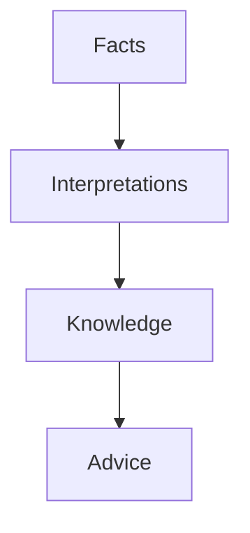

# Domain Vision

---

# Purpose

This document defines the long-term vision of the Household Financial Intelligence (HFI) domain.

It describes the future state the domain is expected to support, independently of implementation technologies, user interfaces or deployment models.

The vision serves as a guide for domain evolution and strategic decision-making.

---

# Vision Statement

Household Financial Intelligence aims to become the trusted financial knowledge model for households.

The domain continuously transforms financial facts into meaningful knowledge, enabling families to understand their financial reality, anticipate future outcomes and make better financial decisions.

---

# Why This Domain Exists

Most financial information already exists.

Banks generate transactions.

Merchants generate receipts.

Payment providers generate confirmations.

Financial institutions generate statements.

The problem is not the lack of data.

The problem is the absence of a coherent financial model capable of transforming isolated events into trusted knowledge.

The HFI domain exists to solve that problem.

---

# Domain Mission

The mission of the HFI domain is to preserve financial truth and progressively increase its business value through interpretation, knowledge generation and financial guidance.

The domain evolves by continuously enriching the same financial facts instead of collecting additional information.

---

# Long-Term Vision

The domain evolves through four business capabilities.

Each capability extends the previous one.

No capability replaces another.

---

# Capability Evolution

## Financial Acquisition

The platform becomes capable of preserving trustworthy financial facts.

Output

Reliable Financial History

---

## Financial Understanding

The platform understands what every financial fact represents.

Output

Financial Meaning

---

## Financial Intelligence

The platform identifies patterns and behaviors.

Output

Financial Knowledge

---

## Financial Advisory

The platform assists households in making financial decisions.

Output

Contextual Financial Advice

---

# Domain Evolution Model

The domain never skips layers.

Knowledge cannot exist without facts.

Advice cannot exist without knowledge.

---

# Strategic Goal

The long-term objective is not expense tracking.

The objective is financial decision support.

Expense tracking represents only one capability required to achieve that vision.

---

# Expected Outcomes

When the domain reaches maturity, households should be able to answer questions such as:

* Where does our money actually go?
* How has our financial behavior changed?
* Which expenses are avoidable?
* Which financial goals are at risk?
* How healthy are our finances?
* What should we do next?

Without manually maintaining financial records.

---

# Domain Boundaries

The HFI domain does not replace:

* Banking Systems
* Accounting Systems
* ERP Platforms
* Payment Networks

Instead, it complements them by generating business knowledge from financial evidence.

---

# Future Domain

The initial version intentionally limits its scope.

Future capabilities may include:

* Subscription Management
* Asset Tracking
* Liability Management
* Investment Analysis
* Forecast Models
* AI Financial Copilot
* Financial Simulations
* Household Collaboration
* Open Banking Integration

These concepts are intentionally excluded from the MVP but remain aligned with the domain vision.

---

# Success Criteria

The vision is considered achieved when the platform becomes capable of:

* preserving every financial fact,
* explaining every financial conclusion,
* generating trustworthy financial knowledge,
* supporting better household financial decisions.

---

# Relationship with the Blueprint

The remaining chapters describe how this vision is implemented.

Business Capabilities define what the domain can do.

Strategic Design defines how the domain is organized.

Tactical Design defines how business consistency is protected.

Architecture defines how the domain is implemented.

Together they realize the vision described in this document.
