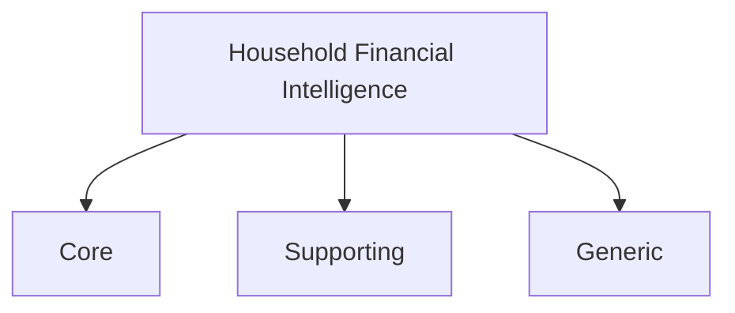
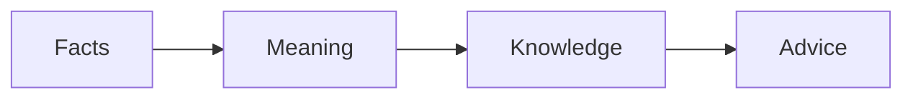
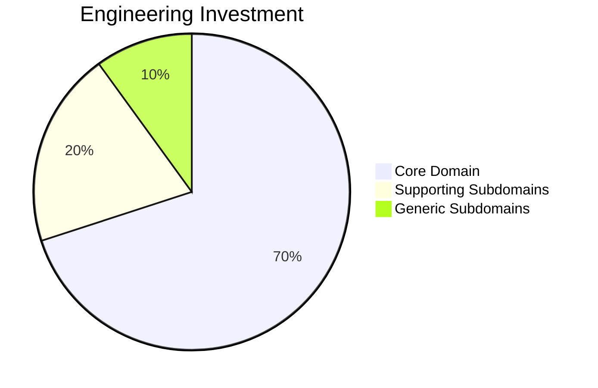
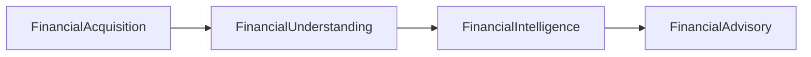

# Core Domain

---

# Purpose

This document identifies the strategic domains that compose the Household Financial Intelligence (HFI) platform.

Following Domain-Driven Design, not every part of the system provides the same business value.

The purpose of this document is to distinguish:

* the Core Domain,
* Supporting Subdomains,
* Generic Subdomains,

and explain where engineering effort should be concentrated.

---

# Domain Classification

The HFI platform is divided into three strategic domain types.

---

# Core Domain

## Definition

The Core Domain contains the unique business knowledge that differentiates HFI from any other financial application.

It represents the intellectual property of the platform.

Every competitive advantage originates here.

---

## Core Domain Statement

The Core Domain of HFI is:

> **Transforming household financial facts into trustworthy financial knowledge.**

The platform is not differentiated by importing emails.

It is not differentiated by reading bank statements.

It is differentiated by understanding financial behavior.

---

## Core Responsibilities

The Core Domain is responsible for:

* preserving financial truth,
* interpreting financial movements,
* generating financial knowledge,
* enabling financial decision support.

Everything else exists to support these responsibilities.

---

## Core Capabilities

These capabilities represent the evolution of the Core Domain.

---

# Supporting Subdomains

Supporting Subdomains enable the Core Domain.

They provide business value but do not differentiate the platform.

Current Supporting Subdomains include:

## Household Management

Responsibilities

* Household lifecycle
* Member management
* Roles
* Permissions

---

## Budget Management

Responsibilities

* Budget definition
* Budget monitoring
* Budget periods

---

## Goal Management

Responsibilities

* Financial goals
* Progress tracking

---

## Financial Sources

Responsibilities

* Source registration
* Authorization
* Synchronization metadata

---

Supporting Subdomains may evolve independently from the Core Domain.

---

# Generic Subdomains

Generic Subdomains provide technical capabilities commonly found in many systems.

Examples include:

* Authentication
* Notifications
* Audit
* Scheduling
* Storage
* Search
* Monitoring
* Logging
* Configuration

These domains should never consume significant modeling effort.

Whenever possible they should rely on existing products or frameworks.

---

# Investment Strategy

Engineering effort should not be distributed equally.

The majority of design effort belongs to the Core Domain.

---

# Domain Evolution

The Core Domain evolves through progressive capabilities.

Supporting and Generic Subdomains evolve only when required by the Core Domain.

---

# Domain Independence

The Core Domain must remain independent from:

* databases,
* cloud providers,
* messaging technologies,
* programming languages,
* external APIs.

Business knowledge must survive technological change.

---

# Success Criteria

The Core Domain is successful when:

* financial facts are preserved,
* interpretations improve over time,
* knowledge becomes increasingly accurate,
* households trust the recommendations produced by the platform.

---

# Relationship with the Blueprint

The following chapters describe the implementation of the Core Domain.

The Capability Map defines what the domain can do.

Strategic Design defines how responsibilities are divided.

Tactical Design defines how business consistency is protected.

Architecture defines how the platform realizes those capabilities.

Everything in this blueprint ultimately exists to support the Core Domain.
