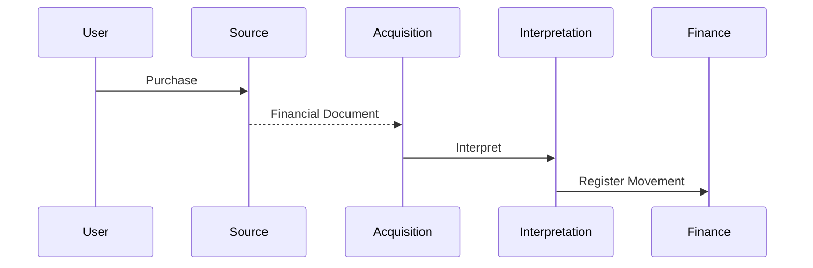

# Domain Storytelling

## Story 01 - Grocery Purchase

Expected outcome:
- Evidence preserved
- Movement registered
- Household history updated

## Story 02 - Category Correction

Only the interpretation changes.
The financial fact remains immutable.

## Story 03 - Duplicate Notification

Duplicate documents must never create duplicate financial movements.
