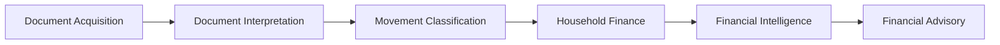

# Context Map

```mermaid
flowchart LR
DA[Document Acquisition]
-->DI[Document Interpretation]
DI-->MC[Movement Classification]
MC-->HF[Household Finance]
HF-->FI[Financial Intelligence]
FI-->FA[Financial Advisory]
```

## Integration Principles

- Event Driven
- Upstream / Downstream
- Reference by Identity
- Small Aggregates
