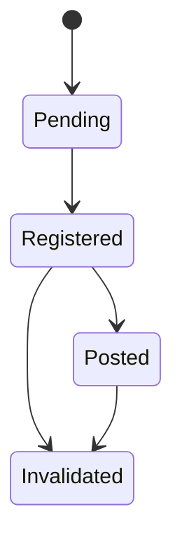

# Business Behavior

## Commands

- RegisterFinancialMovement
- AssignCategory
- InvalidateMovement

## Domain Events

- FinancialMovementRegistered
- MovementPosted
- MovementCategorized
- MovementInvalidated

## Policies

- Duplicate documents never generate duplicate movements.
- Invalidated movements remain part of the audit trail.
- Category changes never modify financial facts.

## Lifecycle

Pending
→ Registered
→ Posted
→ Invalidated

## State Machine

