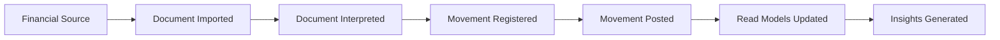

# Event Model Board

## End-to-End Flow

```mermaid
flowchart LR
A[Financial Source]
-->B[Document Imported]
-->C[Document Interpreted]
-->D[Movement Registered]
-->E[Movement Posted]
-->F[Read Models Updated]
-->G[Insights Generated]
```

## Flow
- Command
- Aggregate
- Domain Event
- Policy
- Projection
