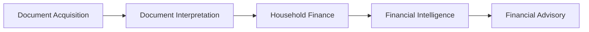

# Architecture Views

```mermaid
flowchart LR
DA[Document Acquisition]
-->DI[Document Interpretation]
-->HF[Household Finance]
-->FI[Financial Intelligence]
-->FA[Financial Advisory]
```

Each bounded context owns its model and communicates through events.
