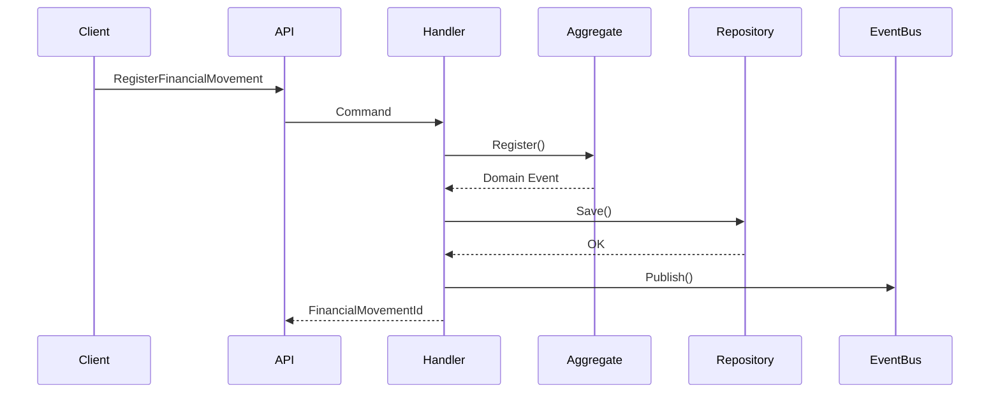

# Sequence Diagram

```mermaid
sequenceDiagram

participant Client

participant API

participant Handler

participant Aggregate

participant Repository

participant EventBus

Client->>API:RegisterFinancialMovement

API->>Handler:Command

Handler->>Aggregate:Register()

Aggregate-->>Handler:Domain Event

Handler->>Repository:Save()

Repository-->>Handler:OK

Handler->>EventBus:Publish()

Handler-->>API:FinancialMovementId
```