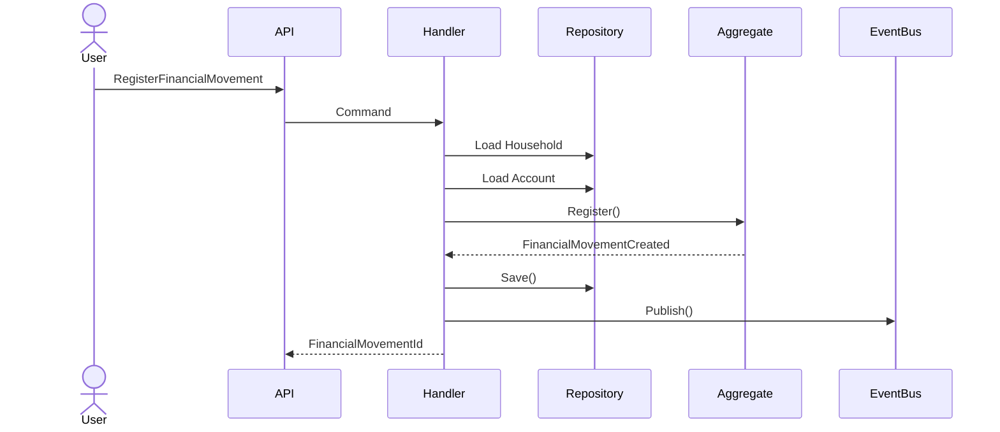

# Main Flow

---

## Alternative Flow 01

Duplicate movement.

Result

DuplicateMovementDetected

---

Alternative Flow 02

Household inactive.

---

Alternative Flow 03

Financial Account not found.

---

Alternative Flow 04

Unauthorized user.

---

Alternative Flow 05

Unsupported currency.